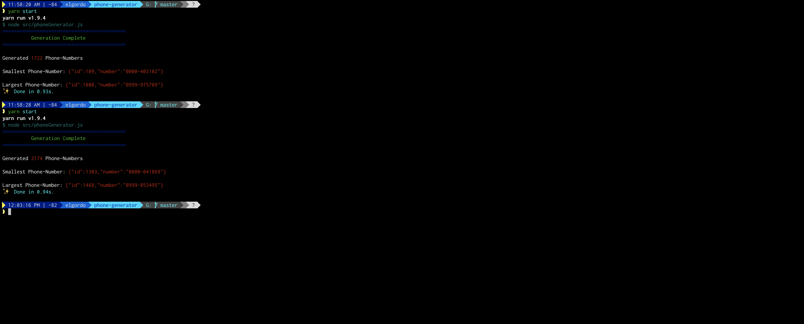
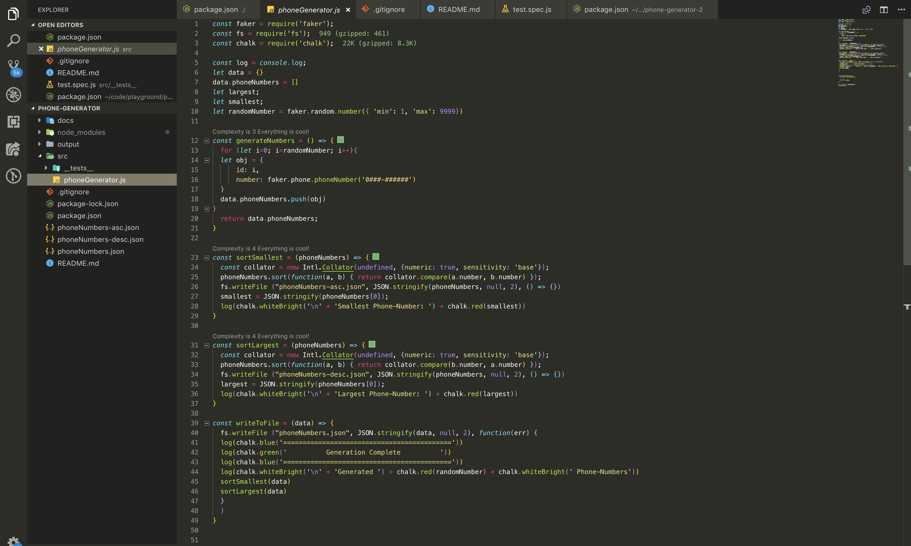

# Random Phone Generator

Node application that Generates Random Phone Numbers.
- It Writes the numbers in 3 files :-
  - 1 - phoneNumbers.json, for all generated numbers.

  - 2 - phoneNumbers-asc.json, for all generated numbers in ascending order based on phone number value.

  - 3 - phoneNumbers-desc.json, for all generated numbers in descending order based on phone number value.

## Getting Started

These instructions will get you a copy of the project up and running on your local machine for development and testing purposes.

#### Prerequisites

What things you need to install the software and how to install them

- `npm or yarn`, npm comes along with the installation of node which can be installed using using `brew install node` on a mac for other platforms follow this  - [Guide](https://www.npmjs.com/get-npm).

## Install

How to get it running on your local machine.

- Clone the Application using this command `git clone https://github.com/kisakyegordon/phone-generator`

## Install Required  Libraries

- Enter the cloned directory.

- Run `npm install` or `yarn`, to install any dependant libraries.

## Start The Application

  * To start the application, run the `npm start` or `yarn start` commands.
  * Starting the application also proceeds to generate a random number  each time its run, the random number relates to the number of phone contacts created each time.

## Running the tests

To locally run the tests

  * run the `npm test` or `yarn test`, you can also see the whole coverage by appending --coverage ie `npm test --coverage`.

## How it works.

- After setting everything up, when you start the application with `npm start` or `yarn start`.

  These are the things that happen :-

  1 - Total Number of randomly generated numbers is logged on the console.

  2 - Smallest and Largest generated numbers are logged on the screen with their Id's.

  3 - 3 files are generated in the applications `root-directory` ie
  - phoneNumbers.json - Contains all generated phone numbers.

  - phoneNumbers-asc.json - Contains generated phone numbers arranged in Ascending order.

  - phoneNumbers-desc.json - Contains generated phone numbers arranged in Deccending order

  
`Logged Information`

  
  `Generated Files`

